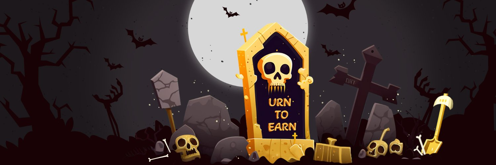
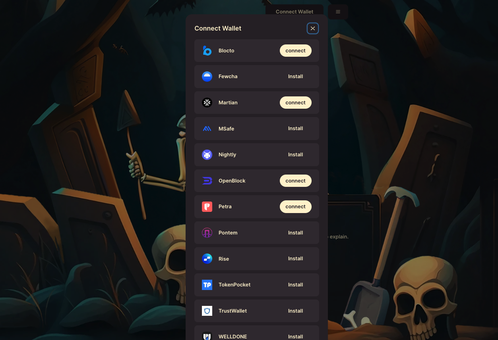
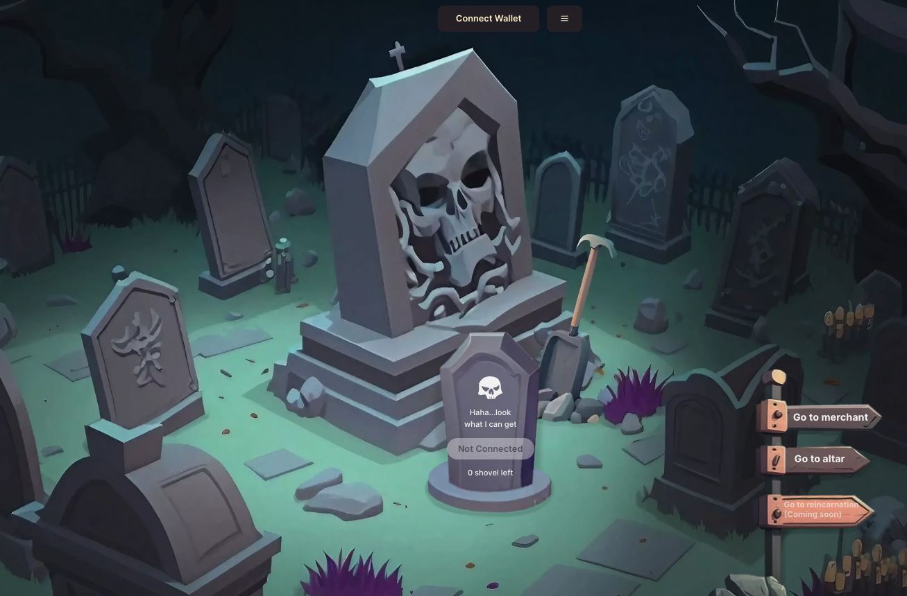
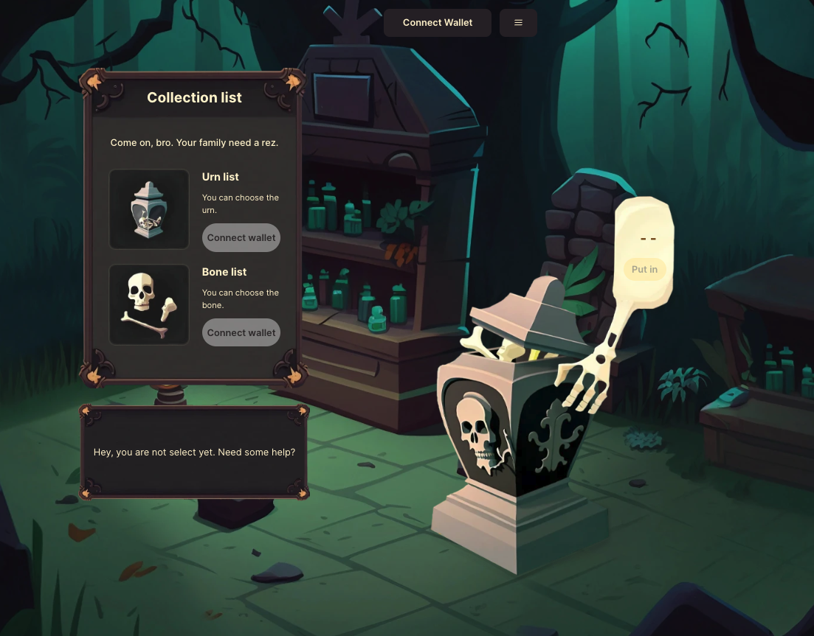
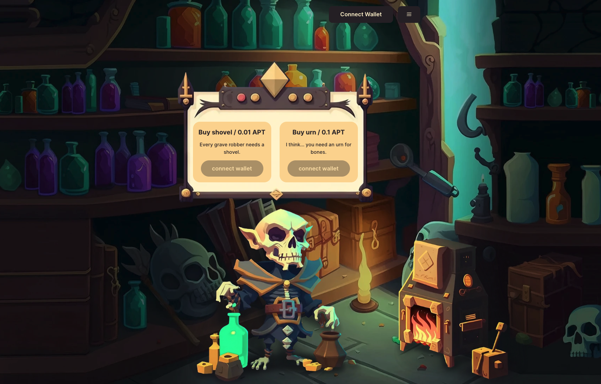
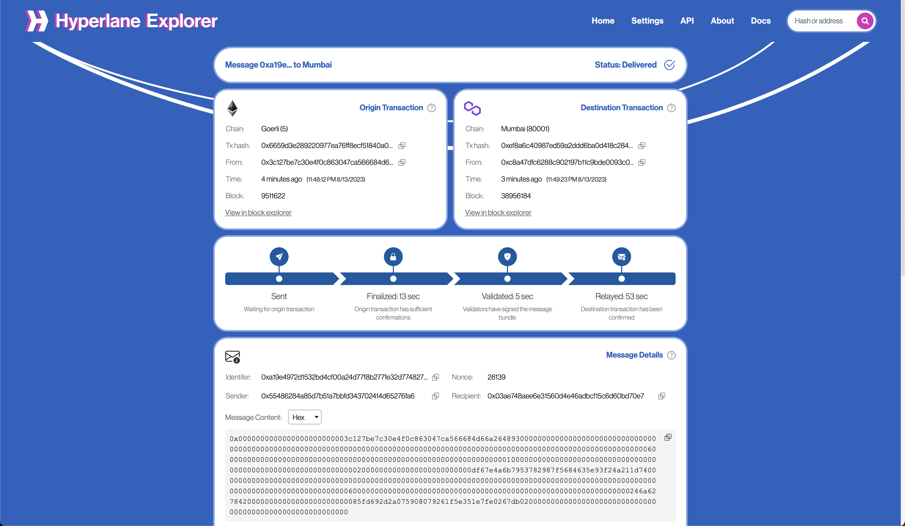
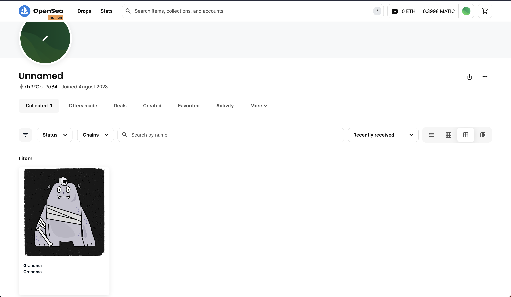

# About this project
This is a cross-chain NFT project between EVM and Move ecosystem

# Description
When it comes to obtaining whitelists, users often have to either shill the project or invite lots of users to the Discord channel. However, we want to make the process of obtaining a whitelist more enjoyable and engaging for everyone involved!

To accomplish this, we've designed a project with a super cool NFT minting process that users can experience right from the beginning. But to get on the whitelist, there's a challenge they must complete first: the gameplay NFT on Aptos. Only by achieving the required goals will their NFTs be regarded as a blind box.

But it doesn't end there. Once users have their blind box NFTs, they can bridge them to the EVM ecosystem to unblind them. This cross-chain NFT project between EVM and Move ecosystem is built using the Move language, and the bridge between EVM chains is powered by Hyperlane.

Unfortunately, Hyperlane currently does not support Aptos, which is why we've implemented a centralized relayer between Aptos and Goerli as a workaround. However, with Hyperlane, we can easily bridge our NFT to any chain that they support.

So, with this project, users not only get to experience a unique NFT minting process, but they also get to participate in a fun and challenging gameplay to earn their spot on the whitelist. And with the ability to bridge their NFTs across different chains, the possibilities are endless!

# Tech stack
This project is built using the Move language, and the bridge between EVM chains is powered by Hyperlane. Unfortunately, Hyperlane currently does not support Aptos. As a workaround, we have implemented a centralized relayer between Aptos and Goerli. However, with Hyperlane, we can easily bridge our NFT to any chain that they support.

# Screenshots
|||
-|-
|||
|||

# Appendix
### Hyperlane history
https://explorer.hyperlane.xyz/message/0xa19e4972d1532bd4cf00a24d77f8b277fe32d774827e5b02e0d0d405421adcef

### Here is the frontend code repo:
https://github.com/sanyu1225/urnToEarn-frontend.git